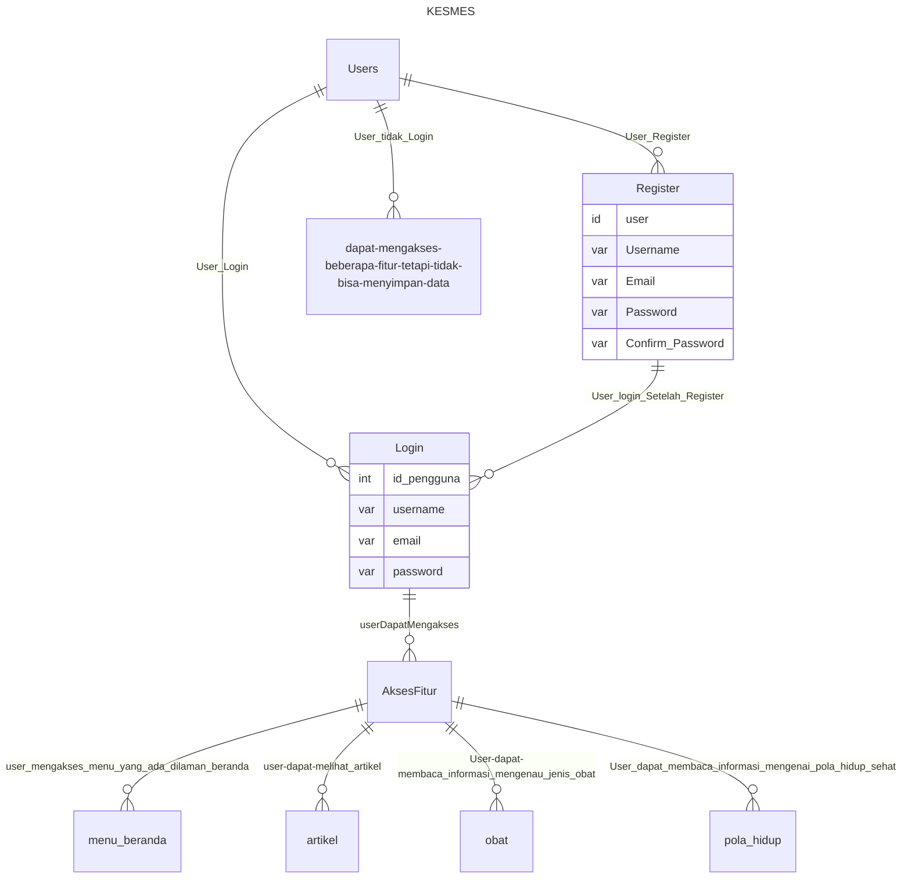
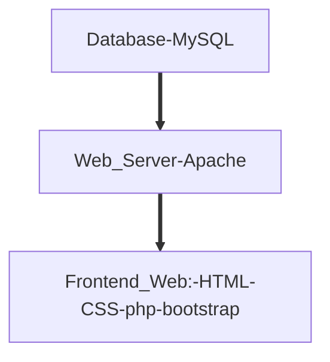

## 1.1 Latar Belakang

Zaman sekarang banyak masyarakat yang sedang sakit malas pergi ke rumah sakit dikarenakan tempatnya jauh, malas antri, tidak adanya layanan kesehatan di daerah tempat tinggalnya dan meremehkan penyakit yang di deritanya. Di zaman yang maju ini kita seharusnya mendapatkan manfaat dari perkembangan teknologi yang semakin canggih . Salah satu dari manfaat dari perkembangan teknologi adalah memudahkan masyarakat dalam memperoleh informasi dengan cepat dan akurat. layanan kesehatan sekarang semakin berkembang melalui internet bahkan sekarang segala sesuatu pun menjadi lebih mudah. oleh karena itu, saya membuat website di bidang kesehatan ini yang bertujuan untuk memberikan edukasi kepada masyarakat menganai pola hidup sehat, memberikan informasi mengenai kasus penyakit yang sedang terjadi, masyarakat atau pengguna bisa konsultasi dari rumah dan tidak perlu pergi ke rumah sakit, masyarakat atau pengguna bisa meminta  petunjuk mengenai apa yang harus dilakukan saat penyakit tersebut sedang terjadi, memudahkan masyarakat dimana saja karena bisa diakses dimana saja dan kapan saja dan bisa meminta rekomendasi obat apa saja yang perlu dibeli untuk menyembuhkan penyakit yang bisa disembuhkan dengan obat. oleh karena itu saya membuat website aplikasi mengenai kesehatan yang bernama KESMAS.
## 1.2. Deksripsi Teknologi Informasi

    website ini berisi tentang solusi dan edukasi mengenai permasalahan yang dialami oleh beberapa masyarakat, agar masyarakat mudah dalam mencari sumber di bidang kesehatan dan bisa menyelesaikan masalah penyakit yang dialaminya.

## 1.3. Branding

* -Merk: KESMES
* -Tagline: "Hidup Sehat Itu Mudah"
* -Campaign: membuat website aplikasi yang bisa membuat penggunannya menggunakan beberapa fitur yang bisa diakses oleh siapapun untuk edukasi mengenai hidup sehat dan bisa mencari informasi mengenai kesehatan.
* -target user:
  * usia 12+
  * seorang yang sedang sakit
  * seorang yang perlu dokter
  * seorang yang sedang perlu informasi mengenai kesehatan
  * seorang yang perlu petunjuk dalam penyelesaian penyakit
  * seorang yang perlu pengobatan
-user experience theme:
  * mudah
  * sederhana
  * banyak fitur yang bisa digunakan
  * mudah terbaca
  * warna : putih yang berkesan bersih dan hijau yang berkesan rileks dan segar.
  * inspirasi 

## 2. User Story

sebagai| saya ingin bisa | sehingga | prioritas
---|---|---|---
pengguna | register | pengguna bisa mendaftarkan akun dan biodata diri, agar dapat masuk menu login | ⭐⭐⭐⭐⭐
pengguna | login | pengguna bisa mengakses semua fitur yang tersedia dalam website | ⭐⭐⭐⭐⭐
pengguna | mengakses fitur dalam website | pengguna bisa menggunakan beberapa fitur yang ada dalam website tersebut | ⭐⭐⭐⭐⭐
pengguna | menjalankan beberapa fitur dengan baik | fitur berfungsi dengan baik | ⭐⭐⭐⭐⭐
pengguna | mengakses menu beranda | pengguna bisa memilih layanan kesehatan  | ⭐⭐⭐⭐⭐
pengguna | mengakses menu obat | pengguna mengetahui informasi mengenai obat | ⭐⭐⭐⭐⭐
pengguna | mengakses menu artikel | pengguna dapat melihat beberapa artikel | ⭐⭐⭐
pengguna | memilih jenis obat | pengguna mengetahui cara dan fungsi obat itu bekerja | ⭐⭐⭐
pengguna | memilih layanan kesehatan  | pengguna dapat mengetahui mengenai layanan khusus yang dipilih | ⭐⭐⭐
pengguna | mengakses menu pola hidup | pengguna bisa melihat informasi list pola hidup | ⭐⭐⭐
pengguna | mengakses menu makanan | pengguna dapat melihat beberapa menu sehat yang telah disarankan | ⭐⭐⭐
pengguna | mengakses menu obat herbal | pengguna bisa mengetahui informasi dan cara memakai obat herbal | ⭐⭐

## 3. Struktur Data

Cara membuat aneka macam bentuk grafik menggunakan mermaid.js bisa lihat di [https://mermaid.js.org/syntax/entityRelationshipDiagram.html](https://mermaid.js.org/syntax/entityRelationshipDiagram.html) 

## 4. Arsitektur Sistem

## 5. Teknologi, Library, dan Framework

saya menggunakan teknologi visual studio code 

## 6. Desain User Experience dan User Interface

Bisa load image 

## 7. Demonstrasi Video

Link youtube nya

## 8. Bagaimana mesin komputasi dan sistem operasi berperan dalam produk teknologi informasimu ?

Link youtube nya di detik jawaban ini

## 9. Bagaimana algoritma, struktur data, dan bahasa pemrograman berperan dalam produk teknologi informasimu ?

Link youtube nya di detik jawaban ini

## 10. Bagaimana metode pengembangan perangkat lunak / Software Development Life Cycle berperan dalam produk teknologi informasimu ?

Link youtube nya di detik jawaban ini

## 11. Bagaimana database / sistem basis data berperan dalam produk teknologi informasimu ?

Link youtube nya di detik jawaban ini# pengenalan_informatika
